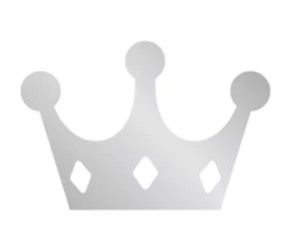
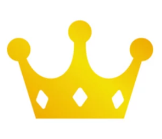

 
 
 

 ## 👋 **Member**

<table align="center" style="font-weight : bold">
    <tr>
        <td align="center">
            
        </td>
        <td align="center">
            
        </td>
    </tr>
    <tr>
        <td align="center">최주은</td>
        <td align="center">박동준</td>
    </tr>
</table>

 

## ✔️ **CHECK LIST**  
- 매일 조금이라도 알고리즘 공부하기
- 매일 커밋하기 (23.06.20 ~, 평일 必 주말 재량껏)  
- 함수형 프로그래밍 지향하기  
- (권장 사항) 각자 본인 디렉토리에 매일 공부한 내용 정리하여 README.md 작성
  

 

## 📌 **RULE**  
 - 매주 월요일 분석 회의
 - 매주 과제 문제들 풀어보고 발표하기  

 

## 💻 STUDY LOG

<strong> 2023/06</strong>

 
<table style="text-aling:center">
  <thead>
    <tr align="center">
     <th>주차</th>
     <th>종류</th>
     <th>레벨</th>
     <th>문제</th>
     <th>유형</th>
    </tr>
  </thead>
  <tbody>
   <tr align="center">
    <td rowspan="2">1주차 (2023/06/19 ~ 2023/06/26)</td>
    <td>프로그래머스</td>
    <td style="vertical-align:middle"></td>
    <td>
      <a href="https://school.programmers.co.kr/learn/courses/30/lessons/154540" target="_blank"> 무인도 여행 </a>
    </td>
    <td>DFS</td>
   </tr>
   <tr align="center">
    <td>백준</td>
    <td style="vertical-align:middle"></td>
    <td>
     <a href="https://www.acmicpc.net/problem/2178" target="_blank"> 미로탐색 </a>
    </td>
    <td>BFS</td>
    </tr>
   <tr align="center">
    <td rowspan="2">2주차 (2023/06/26 ~ 2023/07/03)</td>
    <td>프로그래머스</td>
    <td style="vertical-align:middle"></td>
    <td>
      <a href="https://school.programmers.co.kr/learn/courses/30/lessons/1838" target="_blank"> 몸짱 트레이너 라이언의 고민 </a>
    </td>
    <td>카카오</td>
   </tr>
   <tr align="center">
    <td>백준</td>
    <td style="vertical-align:middle"></td>
    <td>
     <a href="https://www.acmicpc.net/problem/2011" target="_blank"> 암호코드 </a>
    </td>
    <td>DP</td>
    </tr>
  </tbody>
</table>

<strong> 2023/07</strong>

 
<table style="text-aling:center">
  <thead>
    <tr align="center">
     <th>주차</th>
     <th>종류</th>
     <th>레벨</th>
     <th>문제</th>
     <th>유형</th>
    </tr>
  </thead>
  <tbody>
   <tr align="center">
    <td rowspan="2">3주차 (2023/07/03 ~ 2023/07/10)</td>
    <td>프로그래머스</td>
    <td style="vertical-align:middle"></td>
    <td>
      <a href="https://school.programmers.co.kr/learn/courses/30/lessons/12979" target="_blank"> 기지국 설치 </a>
    </td>
    <td>Summer/Winter Coding(~2018)</td>
   </tr>
   <tr align="center">
    <td>백준</td>
    <td style="vertical-align:middle"></td>
    <td>
     <a href="https://www.acmicpc.net/problem/1011" target="_blank"> Fly me to the Alpha Centauri </a>
    </td>
    <td>BFS</td>
   </tr>
  </tbody>
</table>

